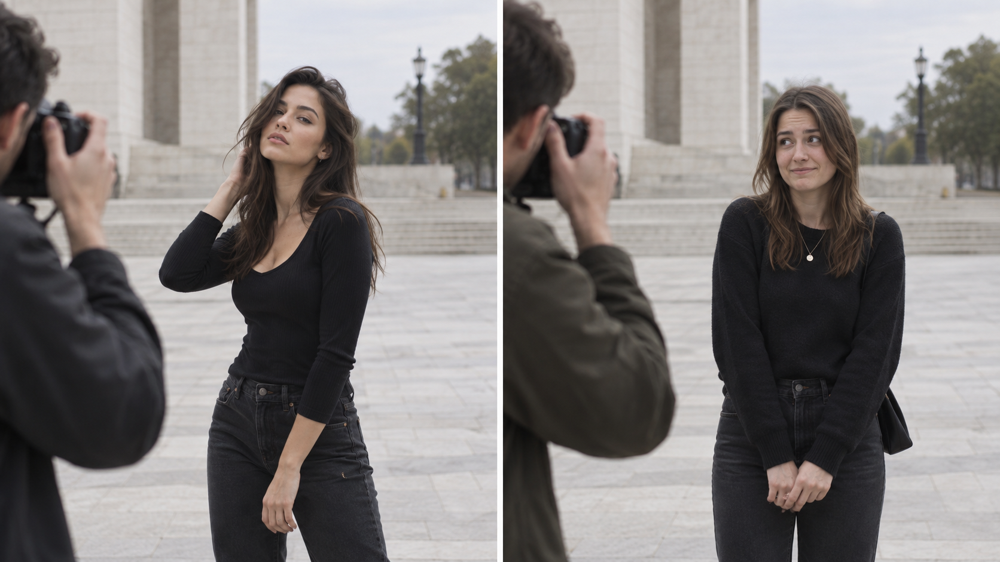
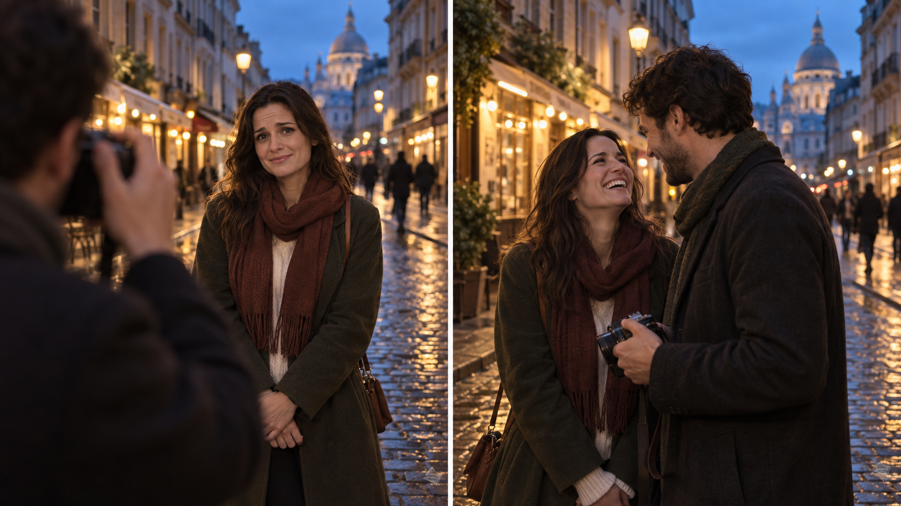

{/* _class: hero week-cover */}

# Partner Photography Is Not a Photoshoot

<p className="week-kicker">WEEK 01 · SLOP1810</p>

<p className="week-subtitle">Good photos are useless if you ruin the date.</p>


```notes
Welcome students to the course and establish the central distinction for the semester.

Partner photography happens inside a relationship and a shared day. The image matters, but it is never the only thing that matters.
```

---

## Four familiar failures

<div className="failure-grid">
  <div>
    <span className="failure-number">01</span>
    <h3>The tourist photo</h3>
    <p>It proves you stood there. It says almost nothing about being there.</p>
  </div>
  <div>
    <span className="failure-number">02</span>
    <h3>The low-angle disaster</h3>
    <p>A kind intention creates a view the subject would never choose.</p>
  </div>
  <div>
    <span className="failure-number">03</span>
    <h3>The candid disaster</h3>
    <p>Unposed does not automatically mean flattering or meaningful.</p>
  </div>
  <div>
    <span className="failure-number">04</span>
    <h3>The photo they hate</h3>
    <p>The exposure is right. The person still asks you to delete it.</p>
  </div>
</div>

```notes
Ask for a show of hands after each example. Most students will recognise at least one.

Keep the discussion light. The purpose is recognition, not embarrassment.
```

---

{/* _class: quote week-question */}

> If a photograph is technically good but the person in it hates it, is it a successful portrait?


```notes
Pause after the question. Invite two or three quick responses without resolving the debate.

The rest of the semester develops the answer.
```

---

{/* _class: case-comparison */}

## A model manages their side of the frame

<div className="comparison-labels">
  <div>
    <span>PROFESSIONAL MODEL</span>
    <p>Finds an angle before the photographer asks.</p>
  </div>
  <div>
    <span>ORDINARY PARTNER</span>
    <p>Becomes self-conscious when the camera takes over.</p>
  </div>
</div>



```notes
Many portrait techniques quietly rely on an experienced subject. The person on the left already knows how to find a pose and repeat it.

The person on the right is not failing. Her reaction is normal. The photographer needs a different method.
```

---

{/* _class: impact partner-rule */}

## Your partner is not a model

<p>Do not ask them to become a better model.</p>

<p><strong>Become a better photographer of ordinary people.</strong></p>

```notes
Make clear that inexperience in front of a lens is normal, not a flaw.

The course shifts responsibility back to the photographer.
```

---

## Two different appointments

<div className="schedule-columns">
  <div>
    <p className="schedule-label">COMMERCIAL PORTRAIT</p>
    <ol className="schedule-list">
      <li><span>14:00</span> Arrive</li>
      <li><span>14:30</span> Lighting</li>
      <li><span>15:00</span> Photograph</li>
      <li><span>17:00</span> Finish</li>
    </ol>
    <p className="schedule-summary">The photograph is the appointment.</p>
  </div>
  <div>
    <p className="schedule-label">A DATE OR TRIP</p>
    <ol className="schedule-list">
      <li><span>10:00</span> Breakfast</li>
      <li><span>11:00</span> Museum</li>
      <li><span>12:30</span> Lunch</li>
      <li><span>14:15</span> “Can you take a photo here?”</li>
      <li><span>14:17</span> Continue the day</li>
    </ol>
    <p className="schedule-summary">The photograph borrows time from the appointment.</p>
  </div>
</div>

```notes
Contrast the two schedules. A professional session gives photography priority. A date gives it a small window inside something larger.

Ask students which schedule looks more like their own experience.
```

---

{/* _class: case-comparison */}

## The stronger frame can be the worse photograph

<div className="comparison-labels">
  <div>
    <span>TECHNICALLY POLISHED</span>
    <p>The light works. The person does not feel at ease.</p>
  </div>
  <div>
    <span>EXPERIENCE INTACT</span>
    <p>The frame is looser. The person feels like themselves.</p>
  </div>
</div>



```notes
Compare the two panels without treating the right one as technically careless. The point is that emotional ease belongs inside the definition of success.

Ask which photograph the subject is more likely to keep.
```

---

## The date has a rhythm

<div className="rhythm-grid">
  <div>
    <span>WHEN TO SHOOT</span>
    <p>Some views are for looking at, not standing in front of.</p>
  </div>
  <div>
    <span>HOW LONG</span>
    <p>Two minutes and thirty minutes create different experiences.</p>
  </div>
  <div>
    <span>WHEN TO STOP</span>
    <p>The next frame may improve the image and damage the hour after it.</p>
  </div>
</div>

```notes
Explain that rhythm is not a fixed time limit. It comes from attention to the person and the day.

Invite students to name a moment when stopping would have been the better choice.
```

---

{/* _class: impact frame-cost */}

<p>At some point,</p>

## the next photograph costs more than it is worth

```notes
Let the sentence sit on screen before moving on.

The cost might be patience, a missed booking, self-consciousness or the mood of the next hour.
```

---

## Mood is part of the exposure

<table className="language-table">
  <thead>
    <tr><th>Instead of saying</th><th>Try</th></tr>
  </thead>
  <tbody>
    <tr><td>“You look weird like that.”</td><td>“Let’s try a different angle.”</td></tr>
    <tr><td>“You’re too stiff.”</td><td>“Walk toward me and fix your sleeve.”</td></tr>
    <tr><td>“No, not like that.”</td><td>“Don’t look at the camera yet.”</td></tr>
  </tbody>
</table>

<p className="table-takeaway">Direction changes expression, posture and trust before it changes the pose.</p>

```notes
Read each pair aloud. The alternative gives the subject something physical and achievable to do.

This is only a preview of the later directing lesson. Today, focus on how language changes the conditions of the photograph.
```

---

## Four systems run at once

<div className="systems-grid">
  <div><span>IMAGE</span><p>Light, framing, perspective and timing</p></div>
  <div><span>PERSON</span><p>Comfort, preference, confidence and appearance</p></div>
  <div><span>MOMENT</span><p>Location, activity, pace and timing</p></div>
  <div><span>RELATIONSHIP</span><p>Communication, patience, trust and mood</p></div>
</div>

```notes
Introduce this as the recurring framework for the semester.

A shoot can succeed in one system and fail in another. Students should avoid collapsing every result into “good photo” or “bad photo.”
```

---

## One photograph, four verdicts

<p className="case-study">A technically excellent sunset portrait. The subject’s smile does not reach their eyes.</p>

<table className="verdict-table">
  <tbody>
    <tr><th scope="row">IMAGE</th><td className="verdict-good">SUCCESSFUL</td></tr>
    <tr><th scope="row">PERSON</th><td className="verdict-bad">UNSUCCESSFUL</td></tr>
    <tr><th scope="row">MOMENT</th><td className="verdict-maybe">QUESTIONABLE</td></tr>
    <tr><th scope="row">RELATIONSHIP</th><td className="verdict-bad">UNSUCCESSFUL</td></tr>
  </tbody>
</table>

```notes
Walk through the example without presenting the verdicts as objective facts.

Reasonable disagreement is useful because students must explain which evidence shaped their diagnosis.
```

---

{/* _class: centered activity-slide */}

<p className="activity-label">PRACTICAL · 10 MINUTES</p>

## The Bad Photo Autopsy

<p>For each photograph, diagnose what happened across the four systems.</p>

<p className="activity-prompt">Which system failed first?</p>

```notes
Place students in pairs or small groups. Give each group several partner-photography failures.

Ask them to label each system as successful, questionable or unsuccessful, then defend one judgement to the class.
```

---

## Week 01 takeaways

<div className="takeaway-list">
  <p><span>01</span>A technically good portrait can still fail the person.</p>
  <p><span>02</span>Ordinary people should not need to perform like models.</p>
  <p><span>03</span>Photography sits inside the rhythm of a shared day.</p>
  <p><span>04</span>Every frame affects the image, person, moment and relationship.</p>
</div>

```notes
Use this slide to recap before the closing statement.

Remind students that the four systems will return throughout the course.
```

---

{/* _class: hero closing-slide */}

# Get the photograph without costing the experience

<p className="week-kicker">NEXT WEEK · PLANNING THE DAY, FINDING THE MOMENT</p>


```notes
End on the course principle, then preview Week 2.

Week 2 turns this idea into planning decisions around route, timing, light and energy.
```
