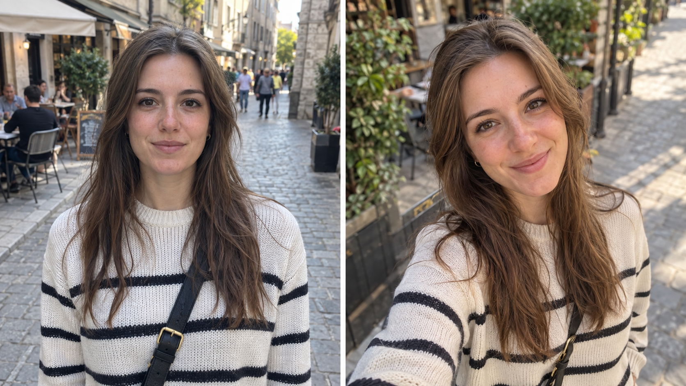
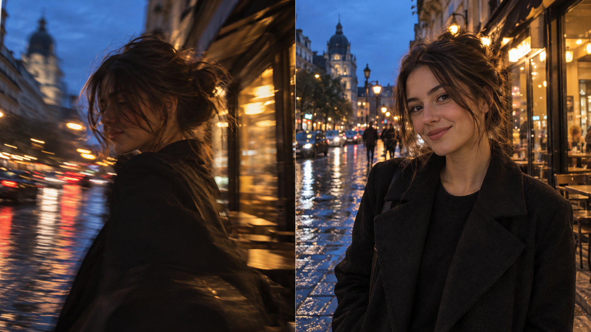
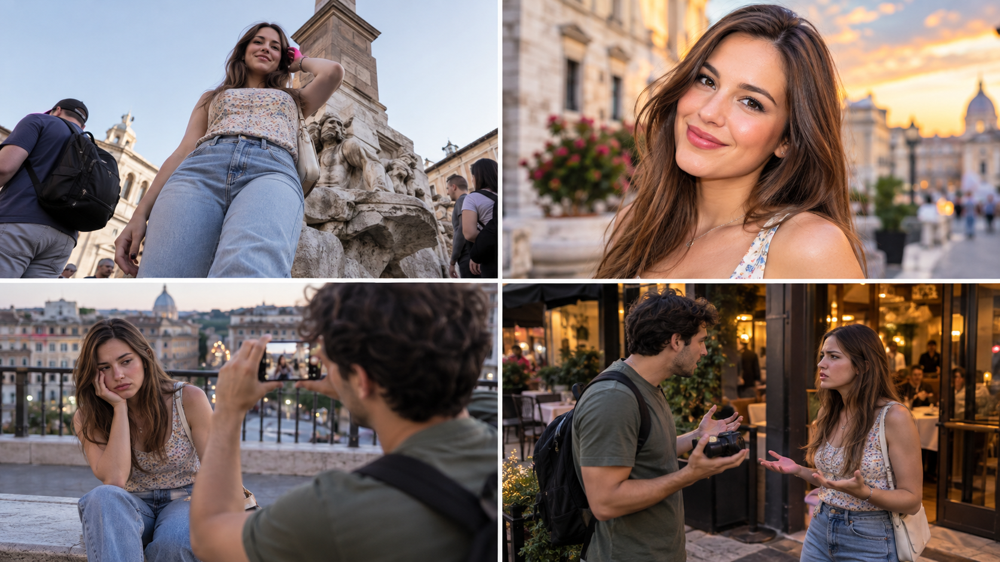

{/* _class: hero week-cover */}

# Does Your Girlfriend Like Your Photos?

<p className="week-kicker">WEEK 01 · SLOP1810</p>

<p className="week-subtitle">A clear photograph is only the beginning.</p>


```notes
Open with the course's central question. Ask students to answer from their girlfriend's perspective rather than their own.

Explain that the semester focuses on ordinary dates, trips and shared outings. Professional technique supports the result, but the result also includes whether she likes the photograph and whether both people enjoyed making it.
```

---

{/* _class: quote week-question */}

> When she last asked for a photo, did she keep the first one?


```notes
Ask for a quick show of hands: kept the first frame, requested a retake, or gave up.

Follow with two questions. Did you understand what she wanted changed? Did taking the photo improve the outing or interrupt it?
```

---

<p className="question-number">QUESTION 01</p>

## What makes a photograph good?

<div className="technical-checks">
  <div><span>COMPOSITION</span><p>The frame looks deliberate, level and free from obvious distractions.</p></div>
  <div><span>CLARITY</span><p>The face is in focus, properly exposed and easy to recognise.</p></div>
  <div><span>MOMENT</span><p>The frame avoids a blink, a half-finished expression or accidental movement.</p></div>
</div>

```notes
Establish the technical floor. The user asked for composition to be correct and the portrait to be clear, so begin there.

Give concrete examples: tilted horizon, awkward crop at a joint, background object appearing from the head, focus on the background, or a frame caught between expressions.
```

---

{/* _class: impact technical-floor */}

## Technical quality is the floor

<p>A straight frame and a clear face prevent obvious failure.</p>

<p><strong>They cannot tell you which photograph she will like.</strong></p>

```notes
Pause on the distinction. Technical correctness makes a photograph usable. Preference decides whether this particular person wants it.

The rest of the lecture asks what sits above the floor.
```

---

{/* _class: case-comparison */}

## A good photograph and the photograph she chooses

<div className="comparison-labels">
  <div>
    <span>TECHNICALLY GOOD</span>
    <p>Clear, level and properly exposed. The expression and angle still may not be hers.</p>
  </div>
  <div>
    <span>HER PREFERRED FRAME</span>
    <p>The style, angle and expression match how she wants to look and share the moment.</p>
  </div>
</div>



```notes
Ask students which side passes the technical check. The answer should be both.

Then ask which one the subject may choose and why. Keep the discussion on angle, expression, background and intended use instead of declaring one side universally better.
```

---

<p className="question-number">QUESTION 02</p>

## Why do you choose different frames?

<div className="judgement-columns">
  <div>
    <span>THE PHOTOGRAPHER MAY NOTICE</span>
    <p>Focus, exposure, background, timing, unusual perspective and a strong colour grade.</p>
  </div>
  <div>
    <span>SHE MAY NOTICE</span>
    <p>Expression, facial angle, proportion, hair, skin tone and whether the image feels like her.</p>
  </div>
</div>

<p className="table-takeaway">You may be answering “Is this interesting?” while she answers “Do I like how I look?”</p>

```notes
Neither list is more sophisticated. The disagreement comes from different criteria.

Ask students to name a technically interesting feature they have defended even when the subject disliked the photograph.
```

---

## The “straight-male photo” complaint

<div className="habit-split">
  <p><span>THE COMMON HABIT</span>The photographer records the whole place, the landmark or the activity. He believes the frame accurately proves what happened.</p>
  <p><span>THE EXPECTATION</span>His girlfriend expected a flattering portrait that centres her appearance and works for the way she wants to share it.</p>
</div>

<p className="habit-caution">Gendered habits can shape taste. They cannot tell you what this person likes.</p>

```notes
Name the familiar complaint without treating all men or all women as identical.

The useful response is not to memorise a supposed female aesthetic. Ask what she likes, request reference images and learn her selection criteria.
```

---

{/* _class: impact portrait-elements */}

<p className="question-number">THE THREE ELEMENTS OF PORTRAIT PHOTOGRAPHY</p>

# Model. Model. Model.

<p className="portrait-joke">A joke about how much the person in front of the camera contributes to the frame.</p>

```notes
Deliver this as a photography joke, not a literal rule. A good photographer still controls light, framing, timing and the conditions of the shoot.

The joke introduces a useful fact: a professional model brings trained expression and body control. Many portrait examples quietly rely on that labour.
```

---

{/* _class: case-comparison */}

## A professional model brings trained control

<div className="comparison-labels">
  <div>
    <span>PROFESSIONAL MODEL</span>
    <p>Finds an angle, manages expression, holds posture and repeats a movement on request.</p>
  </div>
  <div>
    <span>YOUR PARTNER</span>
    <p>May become self-conscious, lose track of her hands or tense up when the camera takes over.</p>
  </div>
</div>


```notes
The left side looks easier because the model already manages many variables. The photographer can concentrate on the frame and press the shutter at a reliable moment.

The right side represents an ordinary person without that training. Her awkwardness is normal. The photographer must observe more carefully, communicate more clearly and create conditions where a natural expression can return.
```

---

## A strong portrait uses both people's skills

<div className="shared-practice">
  <div>
    <span>THE PHOTOGRAPHER IMPROVES</span>
    <p>Observation, timing, camera position, clear prompts and attention to fatigue.</p>
  </div>
  <div>
    <span>THE PARTNER GAINS CONFIDENCE</span>
    <p>Preferred angles, comfortable expressions, natural actions and feedback she can explain.</p>
  </div>
</div>

<p className="habit-caution">Shared progress means learning together. It never excuses blaming her for a photograph you failed to understand.</p>

```notes
Good partner photography develops through repeated, respectful practice. The photographer learns how this person looks and moves. The partner learns which directions feel natural and how to describe what she likes.

Keep responsibility clear. A partner can participate in the process, but the photographer cannot dismiss a bad result by saying she does not know how to pose.
```

---

<p className="question-number">THE PHOTOGRAPHER'S OBSERVATION TEST</p>

## Which side of her face does she prefer?

<div className="observation-cues">
  <p><span>LOOK</span>Which side appears most often in the selfies and portraits she keeps?</p>
  <p><span>NOTICE</span>How does she turn when she relaxes, talks or looks toward you?</p>
  <p><span>ASK</span>Does she have a preferred side, and what does she like about it?</p>
</div>

<p className="table-takeaway">Careful observation is a photographic skill and a form of knowing your partner.</p>

```notes
Ask students to answer before showing the prompts. Many will realise they have photographed their partner often without knowing the answer.

A preferred side can relate to expression, asymmetry, hair, habitual pose or simple familiarity. Observation creates a hypothesis. Asking confirms it. The goal is knowledge, not a permanent rule that prevents experimentation.
```

---

{/* _class: impact partner-rule */}

## Her taste is specific

<p>Do not guess what “women like.”</p>

<p><strong>Learn what she likes.</strong></p>

```notes
Use this as the shift from a stereotype to a working method.

Preferences may include camera height, preferred side, bright or muted colour, posed or candid images, how much environment appears, and where the photograph will be used.
```

---

<p className="question-number">QUESTION 03</p>

## Is an artistic portrait useful for everyday sharing?

```notes
Invite a quick answer before revealing the comparison.

The expected answer is sometimes. Purpose decides whether atmosphere, ambiguity and experimentation help or obstruct the photograph.
```

---

{/* _class: case-comparison */}

## Art and everyday sharing serve different purposes

<div className="comparison-labels">
  <div>
    <span>ARTISTIC PORTRAIT</span>
    <p>Motion, shadow and an obscured face create atmosphere and ambiguity.</p>
  </div>
  <div>
    <span>EVERYDAY SHARE</span>
    <p>A recognisable face and natural skin tone make the moment easy to keep and post.</p>
  </div>
</div>



```notes
Treat both sides as successful photographs. The left succeeds as an expressive image. The right succeeds as a clear personal record.

Ask what happens when the photographer delivers only the left image after the subject asked for the right one.
```

---

## The photograph needs a job

<div className="purpose-list">
  <p><span>CREATIVE WORK</span>Atmosphere, ambiguity and experimentation may lead.</p>
  <p><span>TRAVEL MEMORY</span>The place and the person both need to remain recognisable.</p>
  <p><span>SOCIAL POST</span>Expression, proportion and immediate shareability often matter most.</p>
  <p><span>PROFILE IMAGE</span>The face must read clearly at a small size.</p>
</div>

```notes
Ask students to imagine photographing the same scene for each purpose.

The practical lesson is to clarify the job before choosing the style. One scene may need two frames: one creative image and one clear portrait.
```

---

<p className="question-number">QUESTION 04</p>

## How does one photo request become an argument?

<div className="contact-labels">
  <span>FAILED COMPOSITION</span><span>FAILED EDIT</span><span>FATIGUE</span><span>THE DATE BREAKS DOWN</span>
</div>



```notes
Use the four panels as one sequence rather than four unrelated mistakes.

The camera starts too low and the frame fails. A later edit tries to rescue the result but changes the person. Repeated attempts create fatigue. The photography then consumes the outing and the disagreement reaches the relationship.
```

---

## Conflict accumulates across the shoot

<ol className="conflict-sequence">
  <li><span>01</span><strong>Different viewpoints</strong><small>You frame the place. She expected you to frame her.</small></li>
  <li><span>02</span><strong>Different taste</strong><small>You defend the style. She still dislikes how she looks.</small></li>
  <li><span>03</span><strong>Repeated attempts</strong><small>The same mistake produces more versions instead of a better choice.</small></li>
  <li><span>04</span><strong>Fatigue</strong><small>Expressions harden and directions begin to sound critical.</small></li>
  <li><span>05</span><strong>Lost rhythm</strong><small>The photo stop takes over the date.</small></li>
</ol>

```notes
Explain that the visible argument usually arrives late. Earlier decisions created the conditions for it.

Invite students to identify the earliest moment where the sequence could be interrupted.
```

---

<p className="question-number">QUESTION 05</p>

## What does a successful shoot protect?

<div className="outcome-split">
  <div><span>THE PHOTOGRAPH</span><p>Clear, intentional, appropriate for its purpose and something she wants to keep.</p></div>
  <div><span>THE EXPERIENCE</span><p>Comfortable, respectful and short enough that both people still enjoy the day.</p></div>
</div>

<p className="table-takeaway">Professional skill supports both outcomes. It does not replace either one.</p>

```notes
Reject the idea that relationship comfort excuses careless photography. Someone trusted you to make them look good.

Also reject the idea that one excellent image compensates for making the whole afternoon miserable. Everyday partner photography must protect both outcomes.
```

---

## Five questions before the camera comes up

<ol className="preflight-questions">
  <li><span>01</span>What is this photograph for?</li>
  <li><span>02</span>Can you show me one or two examples you like?</li>
  <li><span>03</span>Which angles, features or edits do you like or dislike?</li>
  <li><span>04</span>How long do we want to spend here?</li>
  <li><span>05</span>Can we review a few frames before taking more?</li>
</ol>

```notes
These questions replace assumptions with usable information.

If she dislikes a frame, ask why. Her answer should change the next photograph rather than start a defence of the previous one.
```

---

{/* _class: centered activity-slide */}

<p className="activity-label">PRACTICAL · THE FIRST PHOTO CONVERSATION</p>

## Bring three photographs

<p>One you think is good. One she likes. One where your opinions differ.</p>

<p className="activity-prompt">What would improve the photograph and the experience?</p>

```notes
Students first check composition, clarity and moment. Then they compare the photographer's reason with the subject's reason.

Finish with a short agreement for the next outing: intended use, one visual preference, one editing boundary, an early review point and a stopping condition.
```

---

## Week 01 takeaways

<div className="takeaway-list">
  <p><span>01</span>Composition and clarity create the technical floor.</p>
  <p><span>02</span>Her preferred photograph may use different criteria from yours.</p>
  <p><span>03</span>Artistic value and everyday shareability serve different purposes.</p>
  <p><span>04</span>Fatigue, editing and lost date rhythm can turn a photo problem into a relationship problem.</p>
  <p><span>05</span>A successful shoot produces a wanted photograph and protects the day around it.</p>
</div>

```notes
Recap the question chain rather than presenting professional technique as the course's main goal.

The technical lessons in later weeks exist to solve these ordinary problems more reliably.
```

---

{/* _class: hero closing-slide */}

# A photograph she wants to share, made on a day you both enjoyed

<p className="week-kicker">NEXT WEEK · PLANNING THE DAY, FINDING THE MOMENT</p>


```notes
End with the complete definition of success.

Week 2 turns it into a realistic plan for timing, location, energy and a stopping condition inside a shared outing.
```
